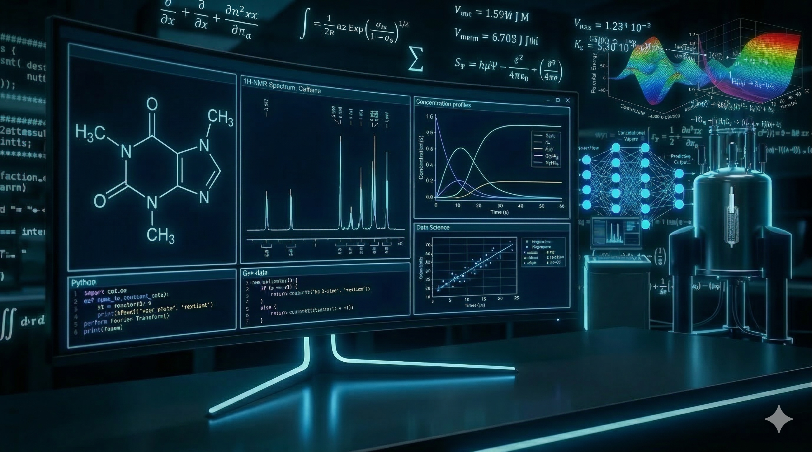

# Hi there, I'm Fernando Uriel Bruno Sánchez! 🧪➕🔢

  

  

## 🚀 About Me

I am a **Chemist** and **Applied Mathematician** from UNAM, dedicated to bridging the gap between molecular science and advanced computation. My work focuses on the synergy of **Data Science**, **Artificial Intelligence**, and **Mathematical Modeling** to solve complex challenges in the chemical industry and R&D.

- 🧪 **Chemical Sciences:** Deep expertise in analytical instrumentation and structural elucidation.
- 🔢 **Applied Mathematics:** Developing stochastic models and numerical simulations to optimize industrial processes.
- 🤖 **AI & Data Science:** Leveraging Machine Learning and Generative AI to transform experimental data into strategic insights.

My goal is to use the power of algorithms and mathematical rigor to drive innovation, sustainability, and operational excellence in the laboratory and beyond.

## 🛠️ Tech Stack & Tools

| Category | Tools |
| :--- | :--- |
| **Languages** |     |
| **Data & AI** |     |
| **Cloud & Ops** |    |

## 📈 My GitHub Stats
<table align="center">
  <tr>
    <td></td>
    <td></td>
  </tr>
</table>

## 📫 Connect with me:
- **LinkedIn:** [/in/fbrunosanchez](https://www.linkedin.com/in/fbrunosanchez)
- **Email:** f.bruno.sanchez@gmail.com
- **Sustainability Project:** [Conciencia 2030 Member]

*"The best way to predict the future is to model it."*
